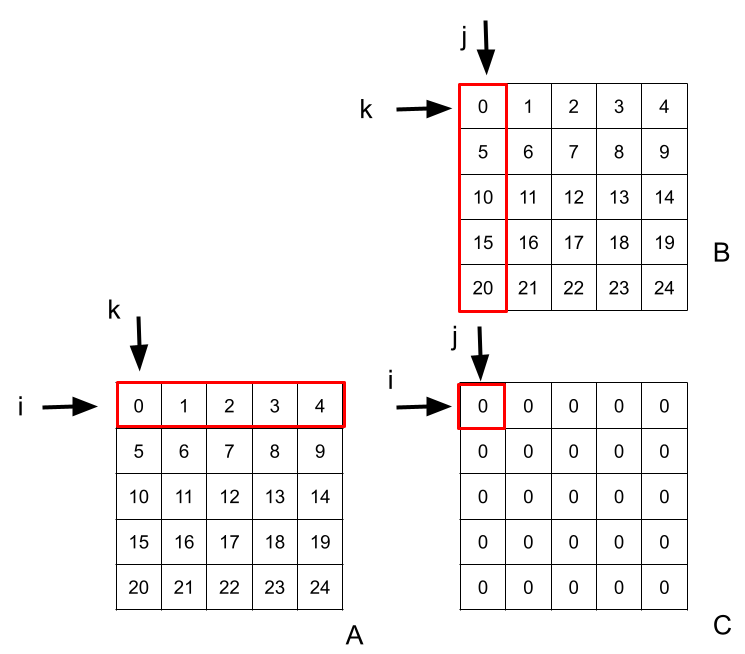

# Matrix Matrix Multiplication Optimization
## Problematic

You probably learnt at school the matrix matrix multiplication formula:

$$C_{ij} = \sum_k{A_{ik}B_{kj}}$$

Translating that formula in C++ gives:

```c++
for (int i = 0; i < N; ++i) {
    for (int j = 0; j < N; ++j) {
        for (int k = 0; k < N; k++) {
            C[i][j] += A[i][k] * B[k][j];
        }
    }
}
```

This implementation looks so straightforward and simple that one might think there is nothing to optimize.

This may seem surprising but this implementation is actually quite slow.

Let's look on a diagram what happens in memory:



To compute the first element of $C$, we need the first line of $A$ and first column of $B$.

For $A$ everything looks good. The outer loop on $i$ will stop on the first row, and the inner loop on $k$ will iterate on the elements of that row.

It looks good because the way $k$ ierates on $A$ is efficient. The first line of $A$ is stored in a contiguous way in memory. This means that when the program will get $A_{00}$, the computer will actually get the whole row of $A$ and store it in cache. This way, the next time we need an element of $A_{0}$, it will be extremely fast to fetch it since it will be in cache.

For $B$, things are different since the inner loop on $k$ iterates on $B$ columns. This means that the program will fetch and cache each row of $B$ and use only one element for each row. This is highly inefficient.

## Code

```c++
#include <cassert>
#include <chrono>
#include <iostream>
#include <vector>

#define N 1024

using matrix = std::vector<std::vector<double>>;

void reset_matrix(matrix &C) {
    for (int i = 0; i < N; ++i) {
        for (int j = 0; j < N; ++j) {
            C[i][j] = 0.0;
        }
    }
}

bool are_equal(const matrix &X, const matrix &Y) {
    for (int i = 0; i < N; ++i) {
        for (int j = 0; j < N; ++j) {
            if (X[i][j] != Y[i][j]) {
                return false;
            }
        }
    }
    return true;
}

auto multiply_ijk(const matrix &A, const matrix &B, matrix &C) {
    auto start = std::chrono::high_resolution_clock::now();

    for (int i = 0; i < N; ++i) {
        for (int j = 0; j < N; ++j) {
            for (int k = 0; k < N; k++) {
                C[i][j] += A[i][k] * B[k][j];
            }
        }
    }

    auto end = std::chrono::high_resolution_clock::now();

    return std::chrono::duration_cast<std::chrono::milliseconds>(end - start).count();
}

auto multiply_ikj(const matrix &A, const matrix &B, matrix &C) {
    auto start = std::chrono::high_resolution_clock::now();

    for (int i = 0; i < N; ++i) {
        for (int k = 0; k < N; k++) {
            for (int j = 0; j < N; ++j) {
                C[i][j] += A[i][k] * B[k][j];
            }
        }
    }

    auto end = std::chrono::high_resolution_clock::now();

    return std::chrono::duration_cast<std::chrono::milliseconds>(end - start).count();
}

int main(int argc, char **argv) {
    matrix A, B, C_ijk, C_ikj;

    // Initialize sizes
    A.resize(N);
    B.resize(N);
    C_ijk.resize(N);
    C_ikj.resize(N);
    for (int i = 0; i < N; ++i) {
        A[i].resize(N);
        B[i].resize(N);
        C_ijk[i].resize(N);
        C_ikj[i].resize(N);
    }

    // Initialize A and B values
    for (int i = 0; i < N; ++i) {
        for (int j = 0; j < N; ++j) {
            A[i][j] = static_cast<double>(i * N + j);
            B[i][j] = static_cast<double>(i * N + j);
        }
    }

    // BENCHMARK
    for (int s = 0; s < 5; ++s) {
        std::cout << std::endl << "Step: " << s << std::endl;

        reset_matrix(C_ijk);
        std::cout << "IJK: " << multiply_ijk(A, B, C_ijk) << " ms" << std::endl;

        reset_matrix(C_ikj);
        std::cout << "IKJ: " << multiply_ikj(A, B, C_ikj) << " ms" << std::endl;

        assert(are_equal(C_ijk, C_ikj));
    }

    return 0;
}

```
## Results

```console
Step: 0
IJK: 30311 ms
IKJ: 14430 ms

Step: 1
IJK: 26369 ms
IKJ: 14486 ms

Step: 2
IJK: 26373 ms
IKJ: 14897 ms

Step: 3
IJK: 26413 ms
IKJ: 14403 ms

Step: 4
IJK: 26300 ms
IKJ: 15300 ms
```

+80% faster!
